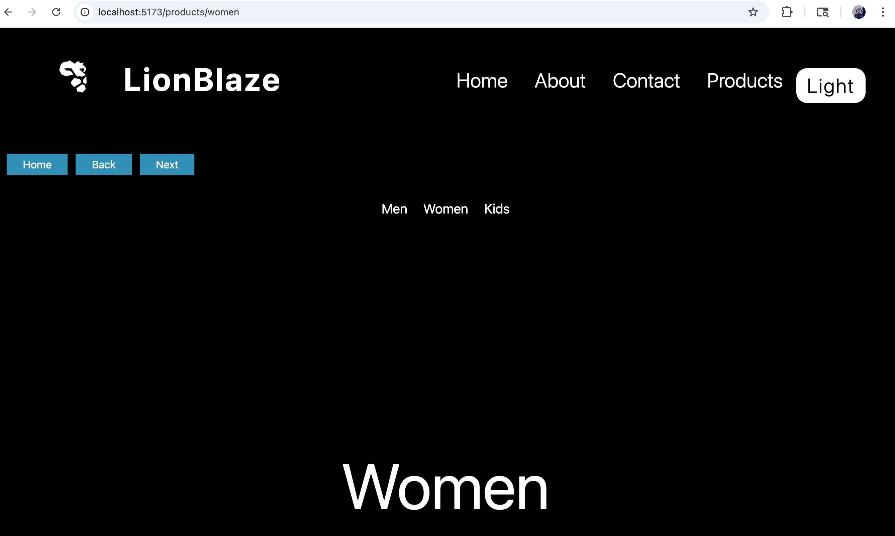
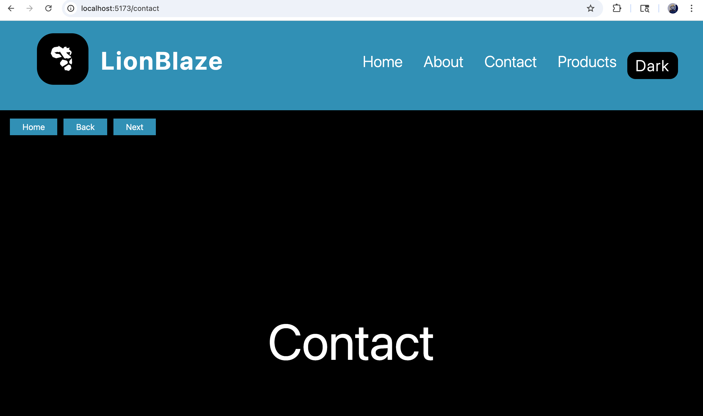

# Advanced React Routing

A React project demonstrating **advanced routing concepts** using React Router DOM, including nested routes, dynamic routing, navigation handling, and global state management using Context API.

---

## Features

- Basic Routing (Home, About, Contact)
- Nested Routing (Products → Men, Women, Kids)
- Dynamic Routing (`/contact/:id`)
- 404 Error Handling
- Theme Toggle (Dark / Light) using Context API
- Navigation Controls (Home / Back / Next)
- Reusable Components (Navbar, Footer, NavigationButtons)

---

## Concepts Used

- React Components  
- React Router DOM  
- Nested Routing (`Outlet`)  
- Dynamic Routing (`useParams`)  
- Navigation (`useNavigate`)  
- Context API (Global State)  
- useState Hook  

---

## Project Structure

```bash
src/
│
├── components/
│   ├── Navbar.jsx
│   ├── Footer.jsx
│   ├── NavigationButtons.jsx
│
├── context/
│   └── ThemeContext.jsx
│
├── pages/
│   ├── Home.jsx
│   ├── About.jsx
│   ├── Contact.jsx
│   ├── Products.jsx
│
├── productSection/
│   ├── Men.jsx
│   ├── Women.jsx
│   ├── Kids.jsx
│
├── error/
│   ├── ErrorIndicator.jsx
│   ├── PageDetail.jsx
│
├── App.jsx
├── App.css
├── main.jsx
├── index.css
```

## Routing Flow

/ → Home  
/about → About  
/contact → Contact  
/contact/:id → Dynamic Page  
/products → Products  
/products/men → Men  
/products/women → Women  
/products/kids → Kids  
`*` → 404 Error Page  

## Preview

### Dark Theme


---

### Light Theme


## Tech Stack

- React (Vite)
- JavaScript (ES6)
- Tailwind CSS
- HTML (JSX)
- React Router DOM
  
## Installation & Setup

```bash
git clone https://github.com/hrjoshi1302/advanced-react-routing.git
cd advanced-react-routing
npm install
npm run dev
```
---

## How It Works

- Routing handled using **React Router DOM**
- Nested routes rendered using `Outlet`
- Dynamic routes handled using `useParams`
- Navigation handled using `useNavigate`
- Global theme managed using Context API
  
## Author

Himal Joshi
